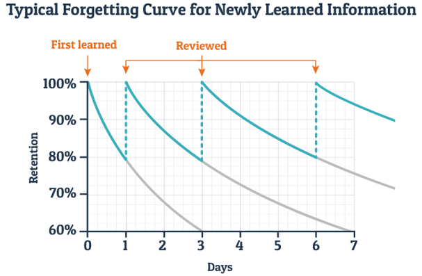
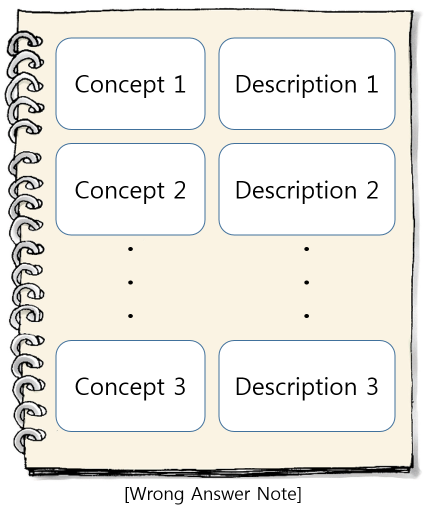
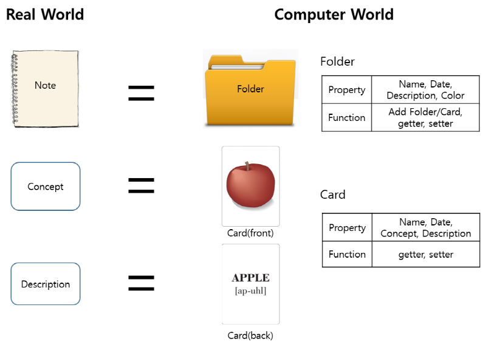
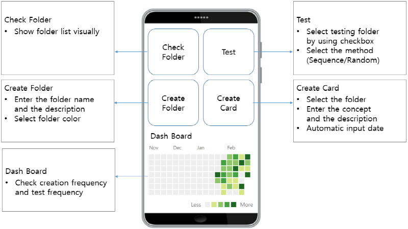

# HelpingMemorizing

##1. Why did I kick-off this project?
I want to reduce study time by studying effectively. **Because time is fixed(24 hour), and there are many things I want to do**.
So I tried to find the theory about forgetting and I found "Ebbinghaus’ memory experimentations".

To maintain memories, I have to do systemaic repeation.
So I make an effort to search mobile apps related helping memories. but I didn't find satisfing app.

So I decided making app by myself **for me**.

##2. Idea
I remembered when I was in the school I studied by using wrong answer note.

Wrong Answer Note Advantage
+ Sorting out the concept
+ Organizing my own concept
+ Repeated study

learning method

1. Purchase note
2. Write Concepts - Description 
3. Repeated check

##3. Concrete
To make mobile app, my idea took concrete shap.

##4. Prototype and Necessary requirement

